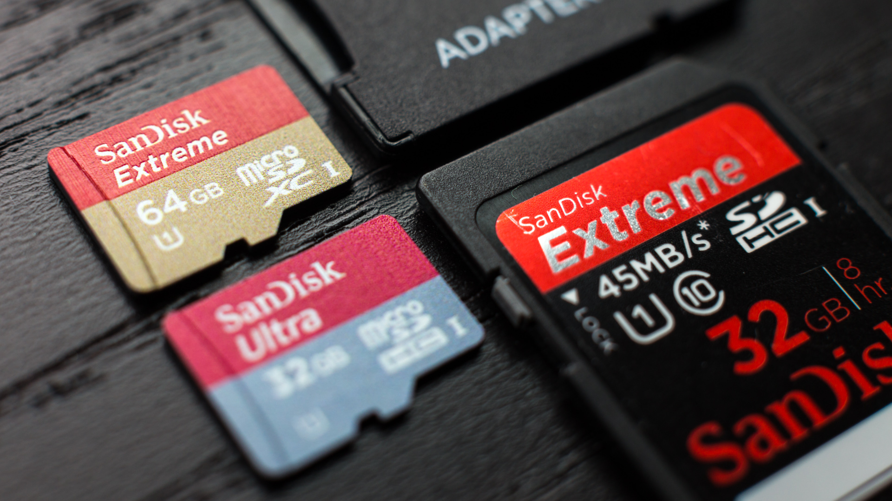

# Flashing image into the RPi SD card

In this short guide we'll teach you how to download an image, download burner software and flash the image into your raspberry pi.

## Pre-requirements

For this short tutorial you'll need the following:


- <b>Windows, Mac or Ubuntu computer</b>
- <b>Micro SD card</b> (if you are not sure which one to buy, keep reading)
- <b>Micro SD card reader</b> (MicroSD to USB adapter)

Using your computer we'll download the image and the raspberry pi imager software to burn the image into your SD card
If you use laptop, you might have a built-in SD card reader, if that's not the case you might need a micro SD reader.

## Using the right SD card



There are many possibilities and options to choose from when you decide what SD card is best for your raspberry pi.
from our perspective, it's best to choose between SanDisk Ultra or SanDisk Extreme series.
When it comes to the size, we recommend at least 16GB but you might find 32GB cheaper and more useful.<br/>

The SanDisk ultra and extreme series offer high data read and write speed, making your general Raspberry Pi experience smooth and convenient. you'll definitely feel the difference when you first boot your raspberry pi into the image, almost as you run it on SSD and normal mechanical HDD.

<b>Best for you:</b> SanDisk Ultra / SanDisk Extreme series, 16GB and up.

## Downloading the right image

<p align="center">
  
</p>

When it comes to the image, we don't offer our own custom images. why?<br/>
The main reason is because Raspberry Pi Foundation keep the images up to date all the time, which will require a lot of effort from us creating new images to catch up on their updates. instead, we create a custom installer to allow you to install all the drivers with one press of a button and make sure your custom installation that is required by different setups and kits that we offer!<br/>

To get the best experience, we suggest to download the latest Raspbian OS from the raspberry Pi Foundation website.
There are multiple versions, some including recommend software and some don't, as we use Raspberry Pi Zero for this course we suggest to either get the Desktop version without the software or with the software if you are just getting started.

[Download Raspbian OS from Raspberry Pi Official website](https://www.raspberrypi.org/downloads/raspberry-pi-os/)

## Downloading raspberry pi imager

<p align="center">
  
</p>

Let's get the raspberry pi imager to burn the actual image into our SD card.<br/>
Choosing the right imager is crucial, that depends on your operation system.<br/>
Click The following links to download the latest version of the imager for Windows, macOS and Ubuntu Linux.<br/>
Only download the owe that fits your OS.<br/>

- [Raspberry Pi Imager for Windows](https://downloads.raspberrypi.org/imager/imager_1.4.exe)
- [Raspberry Pi Imager for macOS](https://downloads.raspberrypi.org/imager/imager_1.4.dmg)
- [Raspberry Pi Imager for Ubuntu](https://downloads.raspberrypi.org/imager/imager_1.4_amd64.deb)

Version: 1.4

If you already have the image installed and you would like to install the imager inside your raspberry pi<br/>
for copying or backup purposes of the current image, you can do so by running the following command in the terminal window:<br/>
```
sudo apt install rpi-imager
```

## Flashing the image

Now to our final step, once you have the image on your computer (should be .img file or .iso file) and the raspberry pi imager downloaded and installed, you are ready to go! open the imager software and it will ask you to choose a file, choose the image you've just downloaded from the raspberry pi website (Raspbian OS) and when selecting drive, make sure to choose the SD card reader that is connected to your computer with the micro SD card.<br/>

Once you are all set and made sure you are burning the image on the right card, press "WRITE" to start the writing process, make sure not to quit the software in the middle! let it work it through and in few minutes you'll be ready with a brand new image of Raspbian OS.
